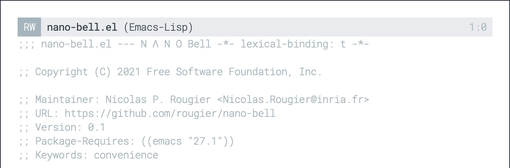

# N Λ N O Bell

N Λ N O Bell is a non intrusive visual bell that flash and fade-out
the header line. The actual bell is a child frame that is overlaid on
top of the header line.

The size and position is controlled by the `nano-bell-update` function
that you can rewrite to adapt the size and position to your liking,
for example if you want to flash the mode line instead or having
something even less intrusive.

The duration of the flash is controled by the `nano-bell-duration`
variable and the number of animation frames is controlled by the
variale `nano-bell-steps`. Color of the flash is defined by
`nano-bell-color`.

# Usage:

```
 M-: (setq ring-bell-function 'nano-bell)
```

# Example


